Игра - угадай цифру
-------------------

Сервер генерирует число от 1 до 10, и ждет варианты в течении 10 секунд.
Тому кто угадал сервер шлет ответ “You win”, тому кто проиграл “You lose”

Сервер генерирует свою цифру от 1 до 10
Клиент подключается к серверу через веб сокет.
После подключения клиент отсылает случайную цифру от 1 до 10.
Через 10 секунд сервер проверяет присланые варианты и отсылает ответы.
После того как ответы высланы сервер отсылает сообещние “Start round”.
Клиенты должны снова прислать свои варианты.

Должна быть реализована логика на сервере и код должен быть покрыт тестами.
Должен быть integration test который может запустить определеное кол-во клиентов.

Stack:
Java 8+
Spring Webflux
Spring Boot 2
Gradle

#Note

В браузере клиента специальный объект 'EventSource' обеспечивает соединение с сервером и работает по обычному протоколу HTTP.
Объект 'EventSource' умеет работать со стримами которые бросает ему сервер (сервер должен ответить с заголовком Content-Type: text/event-stream)

#Web-Client

* Запуск приложения

* Подключение к игре
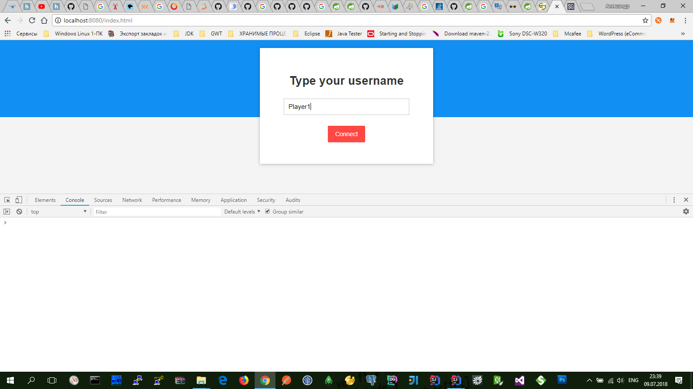
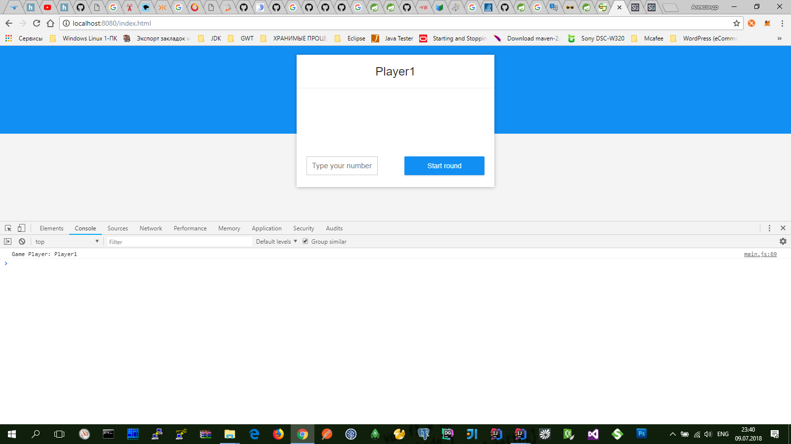
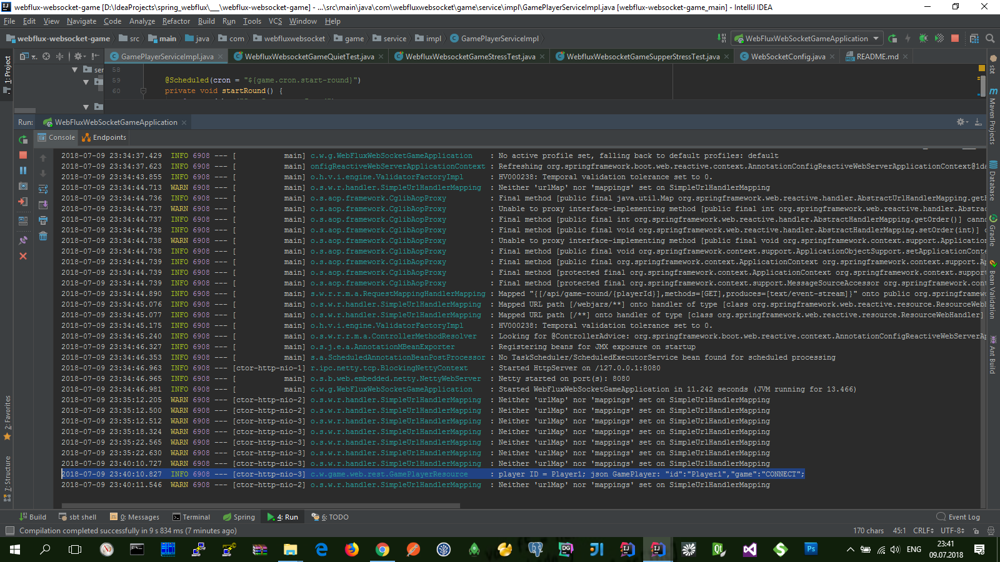

* Новая ставка
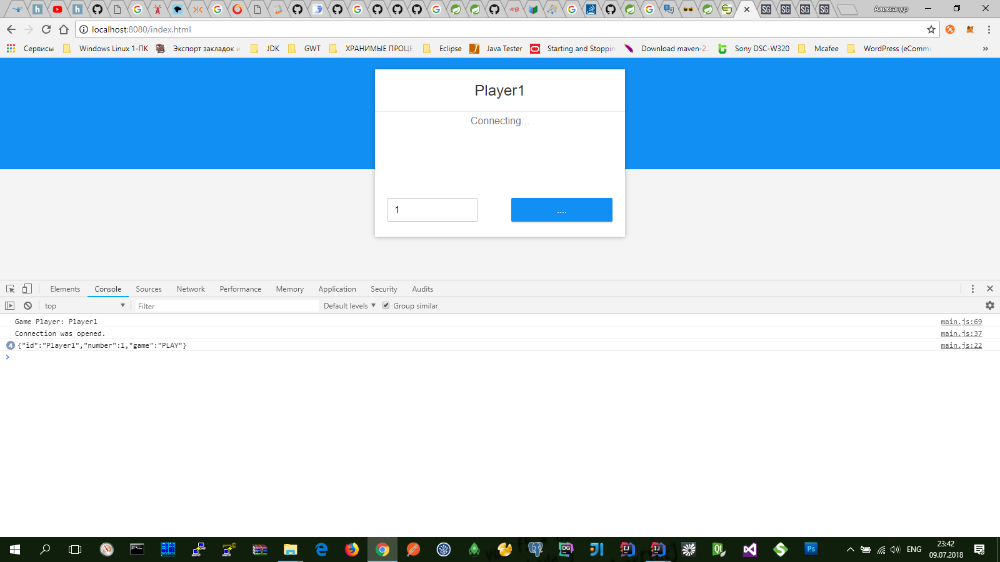
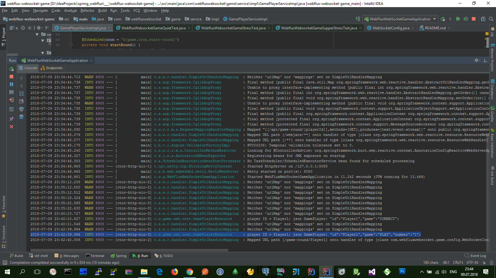

* Сервер разыгривает число между игроками
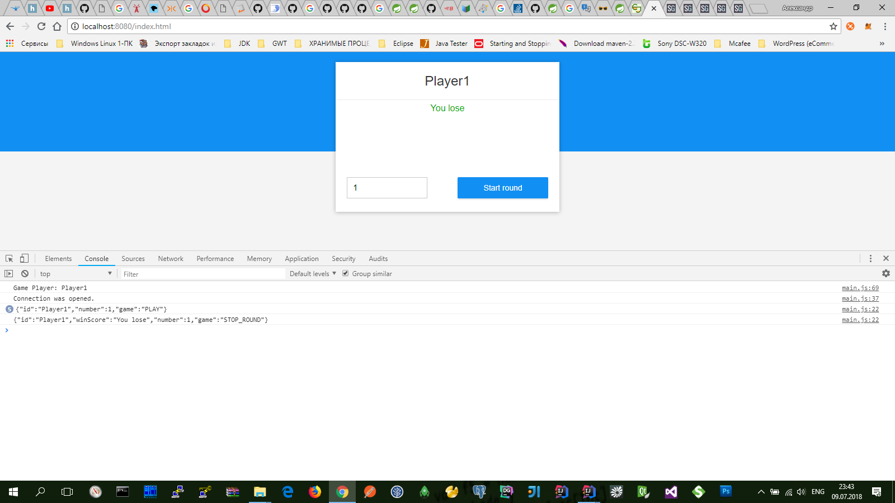
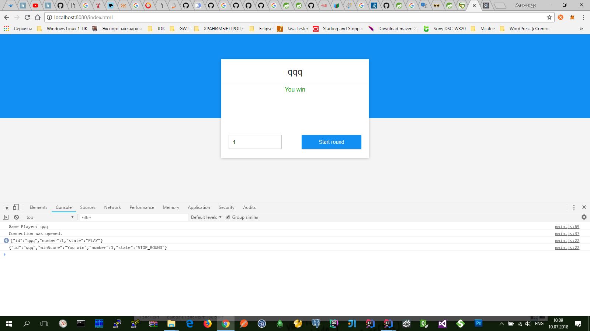

* Игрок пытается сделать несколько ставок в одном раунде
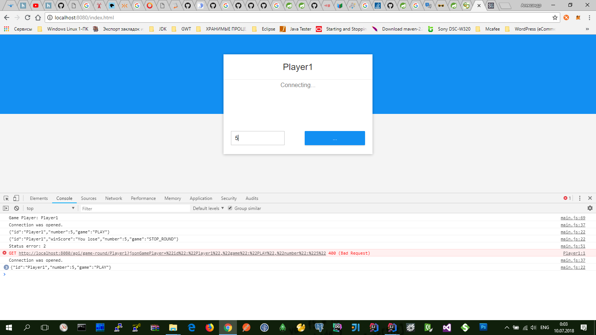
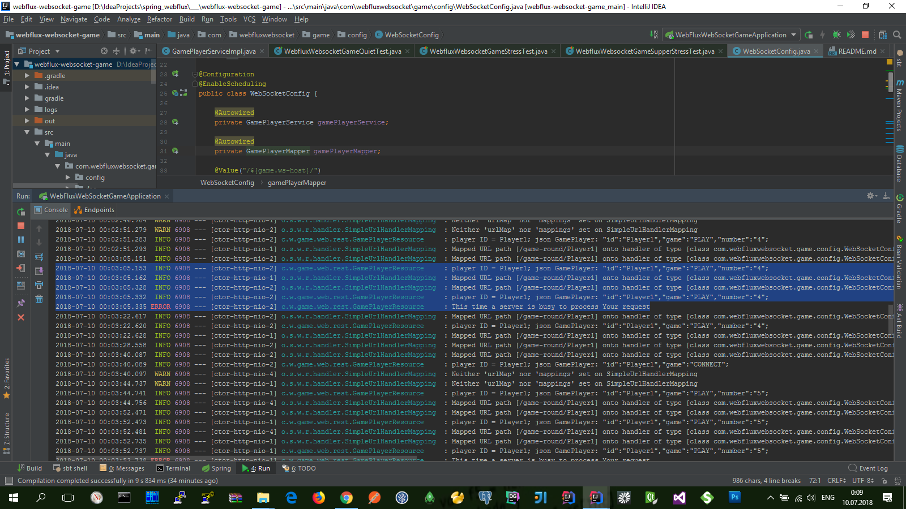

#Test

* для 1-раунда создается 15-игроков
    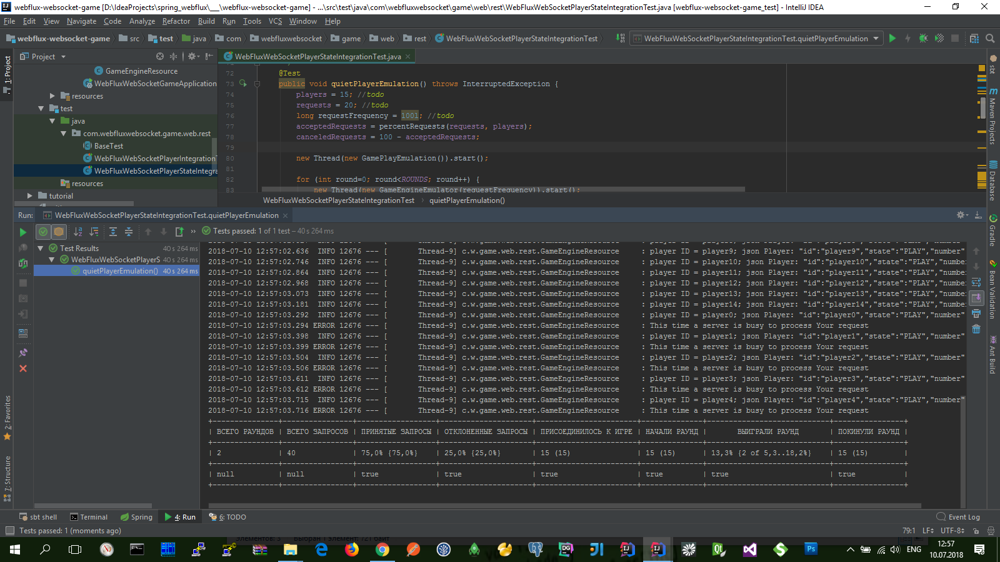

* для 1-раунда создается 150-игроков
    

* для 1-раунда создается 1000-игроков
    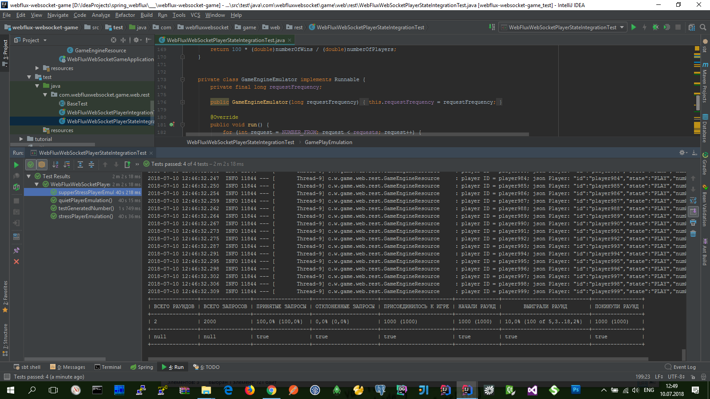
